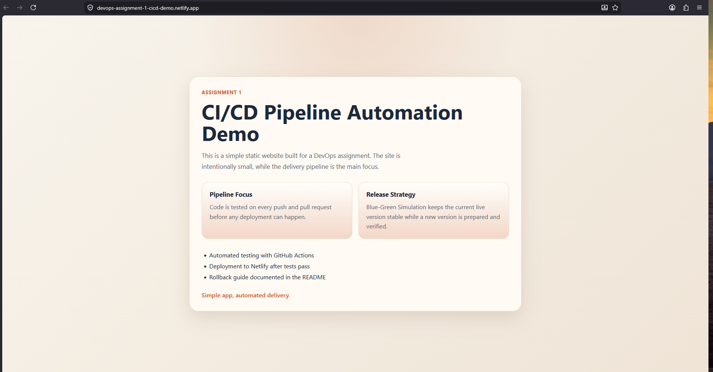
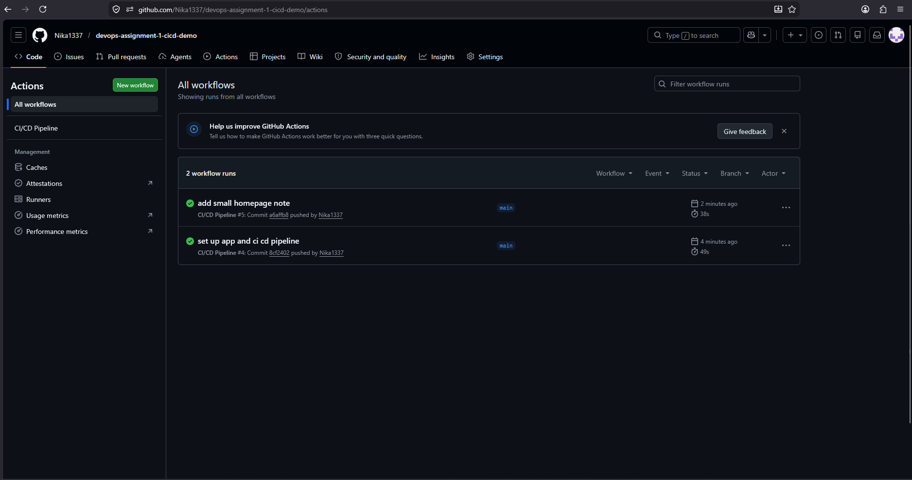

# Assignment 1

Simple static website for the DevOps assignment on CI/CD pipeline automation and deployment strategies.

## Live Application Link

`https://devops-assignment-1-cicd-demo.netlify.app`

## Screenshots




## Pipeline Description

The CI/CD pipeline is defined in `.github/workflows/main.yml`.

- On every `push` to `main` and every `pull_request`, GitHub Actions installs dependencies, runs tests, and builds the project.
- If tests fail, the workflow stops and deployment does not run.
- Deployment happens only after the test job succeeds on `main`.
- The built `dist/` folder is deployed to Netlify.

## Update Strategy

Chosen strategy: `Blue-Green Simulation`

This project uses a simple Blue-Green style approach that fits static hosting on Netlify:

- The current Netlify production deployment is the live version.
- A new version is built and tested in GitHub Actions first.
- Only a successful pipeline can replace the live deployment.

This reduces the chance of broken code reaching production and keeps the release flow simple.

## Rollback Guide

If a bug appears in production:

1. Open the Netlify dashboard.
2. Open the site’s `Deploys` tab.
3. Find the previous stable deployment.
4. Click `Publish deploy` to restore it.

Git-based rollback is also possible:

1. Revert the bad commit.
2. Push the revert to `main`.
3. Let GitHub Actions test and deploy the reverted version.

## Run Locally

```bash
npm install
npm test
npm run build
```
